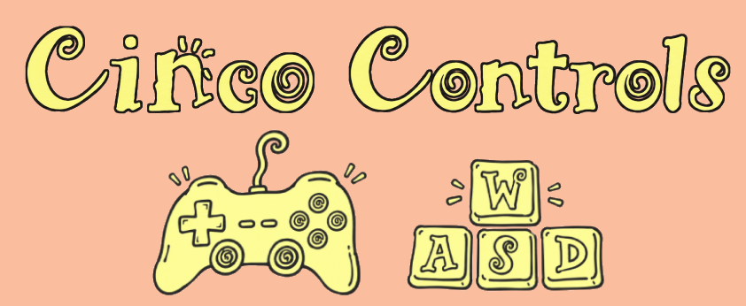
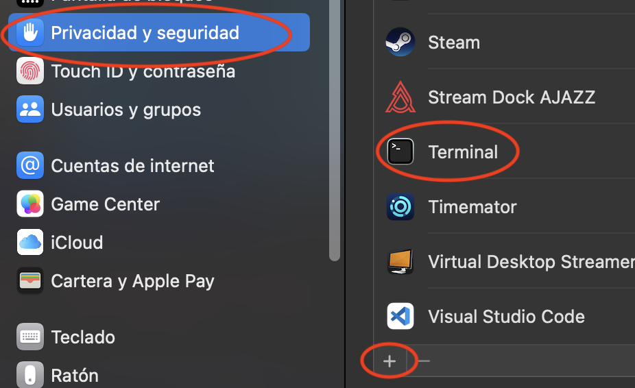

Keyboard movement AND wand casting for [Cinco Paus](https://mightyvision.itch.io/cinco-paus)
(arrow keys / WASD, number keys / zxcvb for wands), on any build, on any OS.
Free, no paid automation app, no OS-specific tool. Reads your live player
position from the save data and drags the mouse for you -- the game itself
is mouse-swipe-only, so this is externally simulating swipes rather than
adding real keyboard support inside the game. Optional game controller
support too (D-pad/stick to move, face buttons for wands).

https://github.com/user-attachments/assets/55027343-bc48-48b9-9213-c95d85eab0df

Also on [YouTube](https://youtu.be/ndgm-qDXB3I).

## Quickstart

1. Double-click the play file for your OS:
   - **macOS**: `play_mac.command` (enable accesibility for Terminal.app
      [see "Permissions" section below for more details], and on the first launch
      right-click the file and choose "Open", since it's an unsigned script and
      Gatekeeper will otherwise block it -- you can also unquarantine it)
   - **Windows**: `play_win.bat`
   - **Linux**: `play_linux.sh`

   It should set itself up automatically, creates a private Python
   environment in `core/venv` and installs everything into it.
   The only thing you need pre-installed is Python 3 (the script
   tells you where to get it if it can't find one).

3. That's it -- it should launch straight into a dashboard showing
   what it's doing, with arrow keys/WASD to move and 1-5/zxcvb to cast
   wands, only while Cinco Paus is the focused window. A working screen
   calibration (`core/config.json`) already ships in this repo, and it'll
   stay correct **no matter what size or position the game window is**:
   Cinco Paus doesn't support changing aspect ratio at all -- window resizing
   is always an integer scale of the same shape -- and calibration is
   stored as a *fraction* of the window, not a fixed pixel, so it's exactly
   as correct at any size. This is true even if the game always launches at
   the same small default size and you resize it every single time (e.g. on
   Windows, which doesn't remember window size between launches).

   You should never need to run `calibrate.py` yourself, but if you ever want
   to press **Ctrl+R** in the running dashboard (suspends it and runs
   calibration in-place, no need to quit) or run it directly:
   `core/venv/bin/python3 core/calibrate.py --wands`
   (`core\venv\Scripts\python.exe` on Windows).

## How it works

- **Reading state**: on desktop builds it reads the plain `.monkeystate`
  save file next to the game; on the Apple Silicon App Store build (which
  never writes that file) it reads the same string out of that build's own
  sandboxed preferences plist instead.
- **Moving**: arrow keys / WASD swipe from a fixed anchor at the board's
  center in that direction.
- **Casting**: number keys / zxcvb pick up a wand (mouse-down on its icon);
  pressing the same slot again cancels it. While a wand is held, direction
  keys aim and auto-release the cast instead of moving, unless manual casting
  is enabled on the dashboard.
- **Dying**: losing a run taps through automatically (death screen, menu)
- **Gamepad** (optional, needs `pygame`, already in requirements.txt):
  D-pad or left stick for movement, 4 face buttons for wand slots 1-4, one
  shoulder button for slot 5, another to confirm a cast.

## Permissions

Both global-hotkey listening and synthetic mouse events need OS
input-monitoring permission for whatever runs Python (usually your
terminal app):
- **macOS**: this is a **required, two-part step**, not optional --
  System Settings -> Privacy & Security -> scroll down to find
  **Accessibility** in that list (it's easy to miss among all the other
  entries there) -> click the **+** button -> add your terminal app.
  Separately, also do the same for **Input Monitoring**. Then fully quit
  and reopen that terminal app -- macOS permissions only apply to processes
  launched *after* they're granted, not ones already running.

   Accessibility, with the + button to add your terminal app">

  Input Monitoring is usually requested automatically by a system popup
  the first time you run this, so it's the one people remember granting.
  Accessibility is the one that's easy to miss, since nothing prompts you
  for it automatically -- and missing it is sneaky in a different way:
  keys *do* get detected and logged normally, but every click/drag it
  tries to make is silently dropped by the OS with no error at all, mouse
  just never moves. The app checks for this on startup and stops with a
  clear message rather than running uselessly, but if two people are
  comparing notes and one says "it detects my keys but nothing happens,"
  this is almost always it.
- **Windows**: no permission dialog, but some anti-cheat/antivirus software
  flags synthetic input tools -- whitelist it if that happens.
- **Linux**: works on X11. On **Wayland** (the default on many modern
  distros), global hotkeys and mouse injection are blocked by design, not
  a bug here -- see `core/README.md` for the `ydotool` workaround.

## Known limitations

- Focus-checking (only acting while Cinco Paus is the active window) is
  macOS-only for now -- on Windows/Linux, hotkeys fire globally regardless
  of which window is focused.
- A wand picked up when focus changes away can stay "held" (the
  synthetic mouse-button never gets released) until you press that slot
  again to cancel it.
- Wall collisions aren't checked before moving -- worst case the game just
  doesn't move you, same as clicking an unreachable tile yourself.

`core/README.md` has the full technical reference (exact flags for every
script, tuning constants like cast distance, and the Wayland/ydotool
workaround in detail) if you need to go deeper than this.

## Companion: automancia

If you also have [automancia](https://github.com/AurenSnyder/automancia)'s
`index.html`, `engine.js`, and `cincomancia/` folder placed in a sibling
`automancia-ios` folder next to this one, the dashboard can also serve and
open it for you (the `[ OPEN AUTOMANCIA ]` button). This is entirely
optional -- movement and wand casting work with or without it.

## Credits

Thanks to AurenSnyder for the inspiration, Cincomancia and Automancia!
To personman on the Cinco Paus Discord for testing, and Michael of course!
